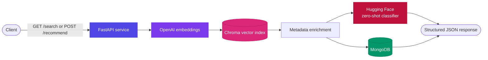
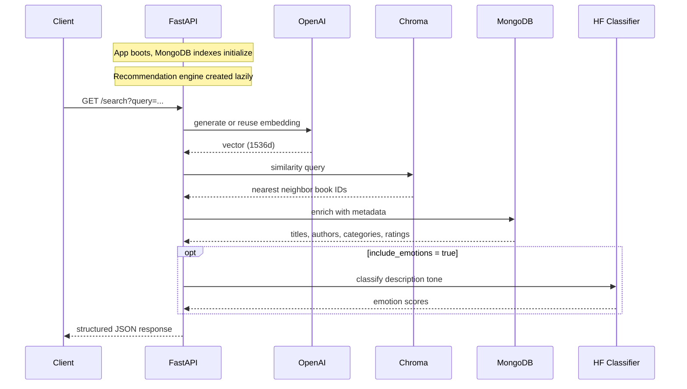

<div align="center">


<br/>

[](https://www.python.org/)
[](https://fastapi.tiangolo.com/)
[](https://platform.openai.com/)
[](https://www.trychroma.com/)
[](https://www.mongodb.com/)
[](https://www.docker.com/)

**Search a book catalog by meaning, mood, and theme — not just keywords.**

[Quick Start](#quick-start) · [API Reference](#api-reference) · [Architecture](#architecture) · [Troubleshooting](#troubleshooting)

</div>

<br/>

## Overview

**lit-pick** (`Book-Agent`) is an AI-powered book recommendation backend. It embeds book descriptions with OpenAI, indexes them in a persistent **Chroma** vector store, and serves semantic recommendations and free-text search through a **FastAPI** service — enriched with **MongoDB** metadata and **Hugging Face** zero-shot emotion classification.

It's built with a production-style service structure: lazy model loading, health checks, structured JSON responses, and a clean separation between the API layer, the recommendation engine, and persistence.

### Core capabilities

| | |
|---|---|
| 🔎 **Semantic search** | Free-text queries matched by meaning via vector similarity, not string matching |
| 🎯 **Recommendations** | Find books similar to a given title using embedding-space nearest neighbors |
| 🎭 **Emotion classification** | Zero-shot scoring of a description's emotional tone |
| 🗂️ **Metadata persistence** | Titles, authors, categories, and ratings indexed in MongoDB |
| ⚡ **Lazy initialization** | Heavy models load on first use, not at boot, keeping startup fast |
| 🩺 **Health & stats** | Built-in `/health` and `/stats` endpoints for observability |

<br/>

## Architecture



### Request lifecycle



<br/>

## Project Structure

```
Book-Agent/
├── .env.example              # Sample environment variables
├── Dockerfile                # Container build instructions
├── docker-compose.yml        # Docker Compose service definitions
├── requirements.txt          # Python dependencies
├── scripts/
│   └── init_chroma.py        # Builds the Chroma vector index
├── src/
│   ├── main.py                # FastAPI application entrypoint
│   ├── api/schemas.py         # Pydantic models for requests/responses
│   ├── config/settings.py     # Environment/configuration settings
│   ├── core/
│   │   ├── recommendation.py  # Recommendation engine orchestrator
│   │   ├── embeddings.py      # RAG pipeline and Chroma integration
│   │   └── classifier.py      # Zero-shot emotion classifier
│   └── database/
│       └── database.py        # MongoDB initialization and connection
├── books_with_emotions.csv   # Book metadata and description data
├── chroma_db/                 # Local Chroma DB artifacts
├── test_endpoints.py          # Basic API endpoint validation script
├── docs/                       # Architecture and setup documentation
└── README.md
```

<br/>

## Quick Start

### 1 · Configure environment

```bash
copy .env.example .env
```

| Variable | Required | Description |
|---|---|---|
| `OPENAI_API_KEY` | ✅ | OpenAI API key for embeddings and optional LLM usage |
| `MONGODB_URL` | ✅ | MongoDB connection string |
| `DATABASE_NAME` | ✅ | Database name, e.g. `litpick` |
| `CHROMA_PERSIST_DIR` | ✅ | Chroma persistence directory — default `./chroma_db` |
| `EMOTION_MODEL` | ✅ | Hugging Face model — default `facebook/bart-large-mnli` |
| `HF_TOKEN` | optional | Required only for private model access |
| `DEBUG` | optional | `True` / `False` |

### 2 · Run locally

```bash
cd c:\Users\amman\Desktop\book-recommendation\Book-agent
python -m venv .venv
.venv\Scripts\Activate.ps1
pip install -r requirements.txt
python scripts\init_chroma.py
python src\main.py
```

Or run with Uvicorn directly:

```bash
uvicorn src.main:app --host 0.0.0.0 --port 5000 --reload
```

### 3 · Or run with Docker

```bash
docker-compose up -d
```

The backend will be available at `http://localhost:5000`, MongoDB at `mongodb://localhost:27017`.

<br/>

## API Reference

| Method | Endpoint | Description |
|---|---|---|
| `GET` | `/` | Service metadata and available routes |
| `GET` | `/health` | Health status, DB connectivity, model state, version |
| `POST` | `/recommend` | Recommendations for a given book, ranked by similarity |
| `POST` | `/classify-emotion` | Emotion scores and top emotion for arbitrary text |
| `GET` | `/search` | Semantic search across book descriptions |
| `GET` | `/book/{book_title}` | Metadata and emotion analysis for a specific book |
| `GET` | `/books` | Top-rated books by average rating |
| `GET` | `/stats` | Engine state, caching stats, vector DB summary |

<details>
<summary><strong>POST /recommend</strong></summary>

```json
// Request
{
  "book": "1984",
  "top_k": 10,
  "include_emotions": true
}
```

Returns structured recommendation data with similarity scores.
</details>

<details>
<summary><strong>POST /classify-emotion</strong></summary>

```json
// Request
{
  "text": "A dark, thrilling story with emotional depth."
}
```

Returns emotion scores and the top predicted emotion.
</details>

<details>
<summary><strong>GET /search</strong></summary>

```
GET /search?query=adventure&limit=5
```

Performs semantic search across book descriptions and returns ranked results with similarity scores.
</details>

Full interactive documentation is available at `/docs` once the service is running.

<br/>

## Development Notes

- `src/core/recommendation.py` is the engine orchestrator — it calls into `src/core/embeddings.py` for vector search and `src/core/classifier.py` for emotion scoring.
- `src/database/database.py` manages MongoDB connections and creates indexes for `books`, `user_preferences`, and `recommendation_cache`.
- `scripts/init_chroma.py` builds the Chroma embedding index from `books_with_emotions.csv`.
- The service is designed for **lazy initialization** — heavy models load on first request rather than blocking startup.

## Testing

```bash
python test_endpoints.py
```

> ⚠️ `test_endpoints.py` targets `http://localhost:8000` by default — update `BASE_URL` if your backend is running on port `5000`.

<br/>

## Troubleshooting

<details>
<summary><strong>Missing OPENAI_API_KEY</strong></summary>

Ensure `.env` contains a valid OpenAI API key — the service validates the key before initializing the RAG pipeline.
</details>

<details>
<summary><strong>Missing Chroma data</strong></summary>

Run `python scripts\init_chroma.py` and confirm `books_with_emotions.csv` is present in the repository root.
</details>

<details>
<summary><strong>MongoDB connection failures</strong></summary>

Verify MongoDB is running and reachable at `MONGODB_URL`. For Docker Compose, use the provided `mongodb` service and ensure its container health check passes.
</details>

<details>
<summary><strong>Slow first request</strong></summary>

Expected — the RAG pipeline and emotion classifier load lazily on first use.
</details>

<br/>

## Roadmap

- [ ] Confirm `.env` is configured correctly
- [ ] Run `python scripts\init_chroma.py` to build the vector database
- [ ] Start the backend with `python src\main.py`
- [ ] Explore the API interactively via `/docs`
- [ ] Extend with a frontend or additional recommendation capabilities

> **Note:** the repository currently includes a placeholder `frontend/` directory; no frontend application code is present in this checkout.

<br/>

<div align="center">

Built with FastAPI, OpenAI, ChromaDB, MongoDB, and Hugging Face.

</div>
